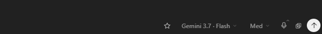
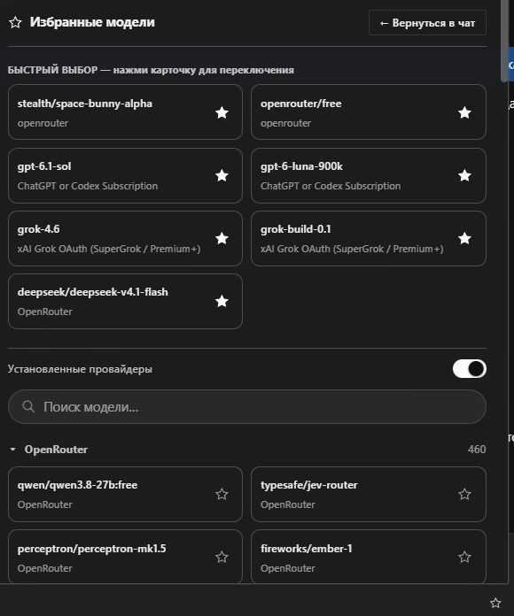
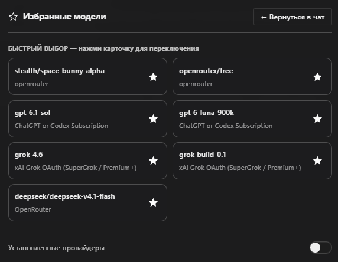

# ☆ Favorites Models Plugin for Hermes Desktop

Плагин интерфейса для [Hermes Desktop](https://github.com/NousResearch/hermes-agent), добавляющий компактную кнопку быстрого выбора избранных моделей прямо в панель чата.

---

## ✨ Возможности

- **Компактная кнопка «☆»** в панели чата перед штатным выбором модели.
- **Умное меню**: показывает только модели из твоих реально настроенных провайдеров.
- **Группировка**: аккуратное сворачивание по провайдерам.
- **Штатный выбор**: использует мост `host.models.select`, корректно переключая модель для текущего или нового чата без сброса настроек профиля.
- **Локальное сохранение**: избранное хранится локально в интерфейсе.

---

## 📦 Как установить на своём ПК

### Вариант 1. В один клик (Windows)
1. Скачайте репозиторий:
   ```bash
   git clone https://github.com/rusanoff1983-del/Hermes.git
   ```
2. Откройте папку `Hermes` в проводнике и дважды кликните по файлу **`install.bat`**.

---

### Вариант 2. Через командную строку (любая система)
1. Откройте терминал на своём компьютере в папке репозитория:
   ```bash
   cd Hermes
   ```
2. Запустите команду установки:
   ```bash
   python install.py --install-deps
   ```
3. В Hermes Desktop нажмите `Ctrl+K` → **«Перезагрузить окно»**.

---

## 📁 Файлы плагина в этой папке

- `plugin.js` — готовый скомпилированный плагин (React / Radix UI).
- `install.py` — скрипт автоматической интеграции и сборки.
- `native-model-selection.patch` — патч для исходников Hermes Desktop.
- `models.ts` — TypeScript-исходник модуля выбора моделей.
- `models.test.ts` — юнит-тесты для TypeScript моста.
- `compatibility.json` — проверенные ревизии совместимости.

---

<details>
<summary><b>📸 Скриншоты интерфейса (нажмите, чтобы развернуть)</b></summary>

<br />

### Расположение кнопки в панели чата:
<p align="center">
  
</p>

### Меню выбора избранных моделей:
<p align="center">
  
  
</p>

</details>
